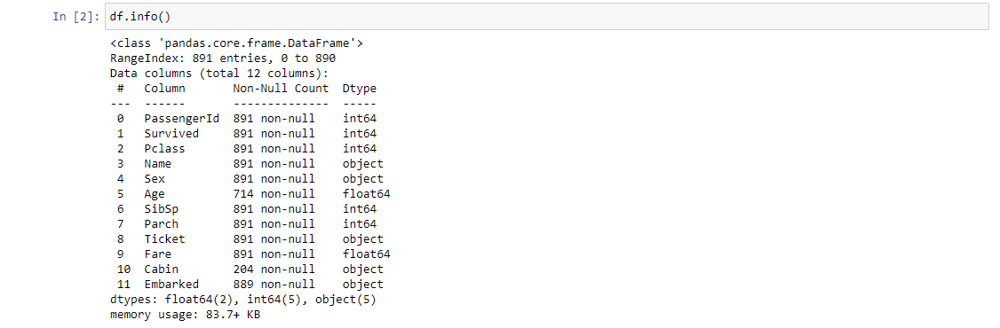
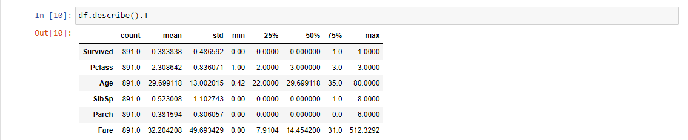

# Kaggle titanic veriseti üzerinde veri bilimi ve makine öğrenmesi çalışması   

## 1-) Veri hakkında genel bilgiler 

### Sütunların açıklamaları 

- #### Survived: hayatta kalma(0 = Hayır, 1 =Evet)
- #### Pclass: bilet sınıfı(1 = 1., 2 = 2., 3 = 3.)
- #### Sex: cinsiyet
- #### Sibsp: Titanik’teki kardeş/eş sayısı
- #### Parch:Titanik’teki ebeveynlerin/çocukların sayısı
- #### Ticket: bilet numarası
- #### Fare: ücret
- #### Cabin: kabin numarası
- #### Embarked: biniş limanı

## 2-) Veri ön işleme

Öncelikle verisetindeki hayatta kalma anlamında anlamlı bir bilgi vermediği bariz olan rastgele olarak oluşturulmuş sütunları verisetinden atalım. Bir kişinin ismi bilet numarası veya ıd sinin hayatta kalması ile bir alakasının olamayacağını düşündüğüm için bu sütunları atıyorum. 


yukarıdaki görselleştirmeden çıkarabileceğimiz 2 sonuç var. Birincisi bu veride eksik veriler mevcut ve bunların icabına bakılmalı. İkincisi bazı sütunlar object tipinde bu sütunların categorical a çevrilmesi gerekiyor.

## Eksik gözlem verilerinin icabına bakılması.

Bu veriseti üzerinde her sütun için ayrı ayrı ele almamız gereken bir sorun. Öncelikle "Cabin" sütununa baktığımızda içerisinde çok fazla eksik gözlem bulunduğunu görüyoruz bu kadar eksik gözleme sahip bir sütunun bize anlamlı bir bilgi sunamayacağını düşündüğüm için bu sütunu verisetinden çıkarıyorum. "Age" sütununu incelediğimizde ise bu sefer içerisinde anlamlı bilgiler taşıyabilecek bir sütun olduğuna karar veriyorum ve eksik verilerin icabına bakmak için bu sütunun ortalamasını alıp eksik olan noktaları bu ortalama ile dolduruyorum. "Embarked" sütununa geldiğimizde ise bu veri sayısal bir veri olmadığı için burada faklı bir yaklaşıma ihtiyacımız var. Burada kullandığım yaklaşım ise eksik verileri en çok tekrar eden veri ile doldurmak. Böylece eksik gözlemlerin icabına bakılmış oldu.

## Object tipindeki verilerin Categorical tipine dönüştürülmesi.

verisetindeki anlamlı bilgiler taşıdığını düşündüğümüz object tipindeki sütunları basit bir python kodu ile kategorik sütunlara çevirelim 

```python
df.Sex = pd.Categorical(df.Sex)
df.Embarked = pd.Categorical(df.Embarked)
```
## Aykırı gözlem verilerinin icabına bakılması.

Bu veriseti özelinde aykırı gözlemeleri diğer gözlemlerden belirgin derecede farklı olsalar dahi eğer bir hata sonucu oluşmamışlarsa veya saçma değerler değillerse onları verisetinden atmama kararı aldım. Tüm sütunlar gündelik hayatta da karşımıza çıkan kavramlar olduğu için böyle bir karar alabilme lüksüm vardı.



Yukarıdaki görselleştirme incelendiğinde aykırı gözlem için bakmamız geren değerler min ve max değerleridir. Öncelikle aykırı gözlem var mıdır? sorusuna min ve max değerlere bakarak karar verilir. Daha sonrasında ise eğer var ise hangi gözlemler aykırı olarak değerlendirilebilir noktasında aykırı gözlem tespit teknikleri kullanılarak karar verilir.
Min ve Max değerleri incelendiğinde ise aykırı gözlem olarak nitelendirilebilecek saçmalıkta bir değer gözüme çarpmıyor. Örneğn bir insanın yaşı 0.42 ila 80 arasında olabilir.
Yada bir insanın kardeş sayısı 0 ila 8 arasında olabilir.

Bu aşamadan sonra veri ön işleme adımlarını bitirip veri görselleştirme adımlarına başlıyorum.

-- Devamm edecek --
