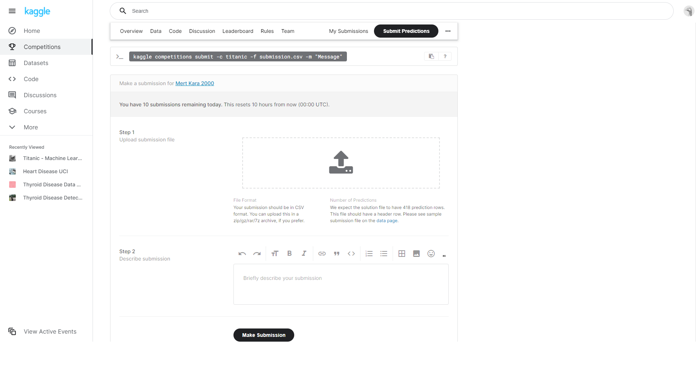
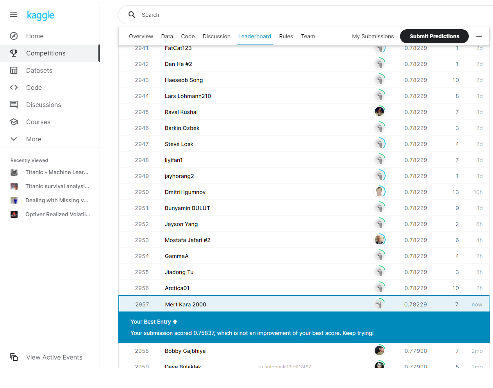

# Kaggle titanic veriseti üzerinde veri bilimi ve makine öğrenmesi çalışması   

## 1-) Veri hakkında genel bilgiler 

### Sütunların açıklamaları 

-  Survived: hayatta kalma(0 = Hayır, 1 =Evet)
-  Pclass: bilet sınıfı(1 = 1., 2 = 2., 3 = 3.)
-  Sex: cinsiyet
-  Sibsp: Titanik’teki kardeş/eş sayısı
-  Parch:Titanik’teki ebeveynlerin/çocukların sayısı
-  Ticket: bilet numarası
-  Fare: ücret
-  Cabin: kabin numarası
-  Embarked: biniş limanı
-  Age: Yaş

## 2-) Veri ön işleme

Öncelikle verisetindeki hayatta kalma anlamında anlamlı bir bilgi vermediği bariz olan rastgele olarak oluşturulmuş sütunları verisetinden atalım. Bir kişinin ismi bilet numarası veya ıd sinin hayatta kalması ile bir alakasının olamayacağını düşündüğüm için bu sütunları atıyorum. 


yukarıdaki görselleştirmeden çıkarabileceğimiz 2 sonuç var. Birincisi bu veride eksik veriler mevcut ve bunların icabına bakılmalı. İkincisi bazı sütunlar object tipinde bu sütunların categorical a çevrilmesi gerekiyor.

### Eksik gözlem verilerinin icabına bakılması.

Bu, veriseti üzerinde her sütun için ayrı ayrı ele almamız gereken bir sorun. Öncelikle "Cabin" sütununa baktığımızda içerisinde çok fazla eksik gözlem bulunduğunu görüyoruz bu kadar eksik gözleme sahip bir sütunun bize anlamlı bir bilgi sunamayacağını düşündüğüm için bu sütunu verisetinden çıkarıyorum. "Age" sütununu incelediğimizde ise bu sefer içerisinde anlamlı bilgiler taşıyabilecek bir sütun olduğuna karar veriyorum ve eksik verilerin icabına bakmak için bu sütunun ortalamasını alıp eksik olan noktaları bu ortalama ile dolduruyorum. "Embarked" sütununa geldiğimizde ise bu veri sayısal bir veri olmadığı için burada faklı bir yaklaşıma ihtiyacımız var. Burada kullandığım yaklaşım ise eksik verileri en çok tekrar eden veri ile doldurmak. Böylece eksik gözlemlerin icabına bakılmış oldu.

### Object tipindeki verilerin Categorical tipine dönüştürülmesi.

verisetindeki anlamlı bilgiler taşıdığını düşündüğümüz object tipindeki sütunları basit bir python kodu ile kategorik sütunlara çevirelim 

```python
df.Sex = pd.Categorical(df.Sex)
df.Embarked = pd.Categorical(df.Embarked)
```
### Aykırı gözlem verilerinin icabına bakılması.

Bu veriseti özelinde aykırı gözlemeleri diğer gözlemlerden belirgin derecede farklı olsalar dahi eğer bir hata sonucu oluşmamışlarsa veya saçma değerler değillerse onları verisetinden atmama kararı aldım. Tüm sütunlar gündelik hayatta da karşımıza çıkan kavramlar olduğu için böyle bir karar alabilme lüksüm vardı.


Yukarıdaki görselleştirme incelendiğinde aykırı gözlem için bakmamız geren değerler min ve max değerleridir. Öncelikle aykırı gözlem var mıdır? sorusuna min ve max değerlere bakarak karar verilir. Daha sonrasında ise eğer var ise hangi gözlemler aykırı olarak değerlendirilebilir noktasında aykırı gözlem tespit teknikleri kullanılarak karar verilir.
Min ve Max değerleri incelendiğinde ise aykırı gözlem olarak nitelendirilebilecek saçmalıkta bir değer gözüme çarpmıyor. Örneğn bir insanın yaşı 0.42 ila 80 arasında olabilir.
Yada bir insanın kardeş sayısı 0 ila 8 arasında olabilir.

## 3-) Veri görselleştirme

Veri görselleştirme aşamasında birçok açıdan veriseti'ni görselleştirdim. Bu görselleştirmeler esnasında dikkatimi çeken veya aklıma takılan sorular oldu ve o noktalara yoğunlaşmayı da ihmal etmedim. Örneğin akraba sayısı ile hayatta kalma arasındaki ilişki gibi. Tüm bu veri görselleştirme aşamasından sonra veriseti hakkında birkaç çıkarım yaptım. Zengin olmak (First Class yada Daha fazla ücret ödeyenler), kadın olmak ve daha az akrabaya sahip olmak hayatta kalma şansını arttıran faktörler olabilir.
! Daha az akrabaya sahip olmak hayatta kalma şansını arttırırken yanlız olmak arttırmıyor.

## 4-) Feature Engineering ve yeni elde edilen özniteliklerin görselleştirilmesi
Bu aşamada öncelikle bir önceki veri görselleştirme aşamasında anlamlı olduğuna karar verdiğim toplam akraba sayısı sütununu oluşturmakla başladım. Öncelikle kardeş ve evebeyn/çocuk sütunlarını topladım daha sonra ise elde edilen sütunu 4 gruba ayırdım. 

&nbsp;   &nbsp; 0 : hiç akrabası olmayan yalnız yolcular için  <br />
&nbsp;   &nbsp; 1 : az sayıda akrabası olan(1-3 arası) yolcular için.  <br />
&nbsp;   &nbsp; 2 : orta sayıda akrabası olan(4-6 arası) yolcular için.  <br />
&nbsp;   &nbsp; 3 : çok sayıda akrabası olan(7 ve üzeri) yolcular için.  <br /> 

Bu sütunu bu şekilde oluşturma kararını ve neyin az orta veya çok akraba olarak sınıflandırılacağını ise veri görselleştirmede elde ettiğim bilgilere dayanarak karar verdim.
Daha sonrasında "Sex" ve "Embarked" sütunlarını sayısal verilere dönüştürdüm. Bu sütunlarıda dahil ederek birkaç veri görselleştirmesi daha yaptım ve son olarak sütunların birbirleri ile ilişkilerini inceleyerek birleştirebileceğim sütunlar varmı onu kontrol ettim. Örneğin yaş sütunu tek başına çokta anlamlı olmayabilir ancak belirli limanlardan binen belirli yaşlardaki insanlar anlamlı derecede hayatta kalmış veya anlamlı derecede vefat etmiş olabilirler.  

## 5-) Makine Öğrenmesi
Burada test için verilen csv dosyası içerisindeki veriyi öncelikle bir pandas dataframe'i içerisine kaydettim. Daha sonra bilinen yöntemler ile önce hedef sütunu diğerlerinden ayırıp sonra özniteliklere normalizasyon işlemi uyguladım.Elde edilen veriyi eğitim ve test verisi olarak ikiye ayırdım.Bu işlemlerden sonra veri makine öğrenemsi modelleri tarafından işlenilebilir hale geldi. Toplamda 13 farklı algoritma kullanarak yüzlerce model kurdum ve en başarılı modelleri elde etmek için GridSearchCV fonksiyonunu  kullandım.

### Model Tuning 
GridSearchCV fonksiyonu kullanılarak makine öğrenmesi algoritmaları kuruldu ve elde edilen en başarılı modellerin parametreleri yazdırıldı.

### Model başarısının değerlendirilmesi
Veri seti dengesiz olduğu için model başarısını ölçmek için AUC değerine bakıldı.

### Tahmin yapma 
Daha önceki aşamalarda elde edilen en yüksek 5 AUC değerine sahip algoritma ve model en başarılı oldukları parametreler ile tekrar kuruldu. Bu modeller bu kez sahip olunan train verisinin tamamı ile eğitildi. "Test.csv" adlı dosyadan test verileri elde edildi. Bu verilere gerekli işlemler uygulandıktan sonra daha önceden kurulan 5 model bu test verisi içerisindeki her gözlem için tahminde bulunup yarışma için istenilen formatta "submission" adlı csv dosyalarına kaydedildi. 

### Tahminlerin gönderilmesi ve sonuç 


tahminler kaggle üzerinden gönderildi ve başarı oranları elde edildi.
